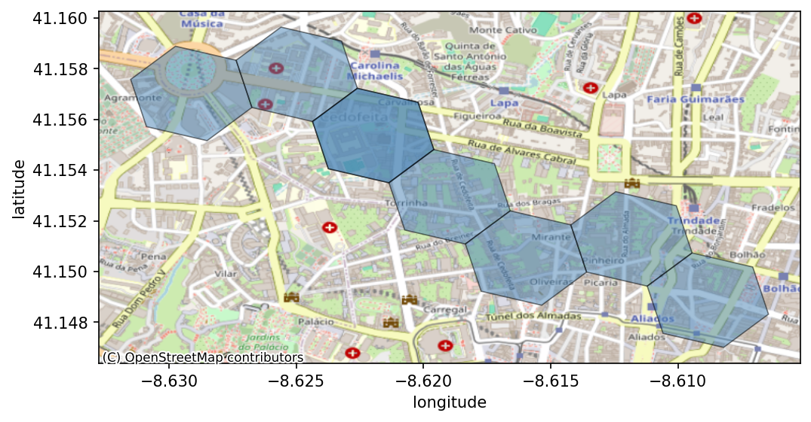
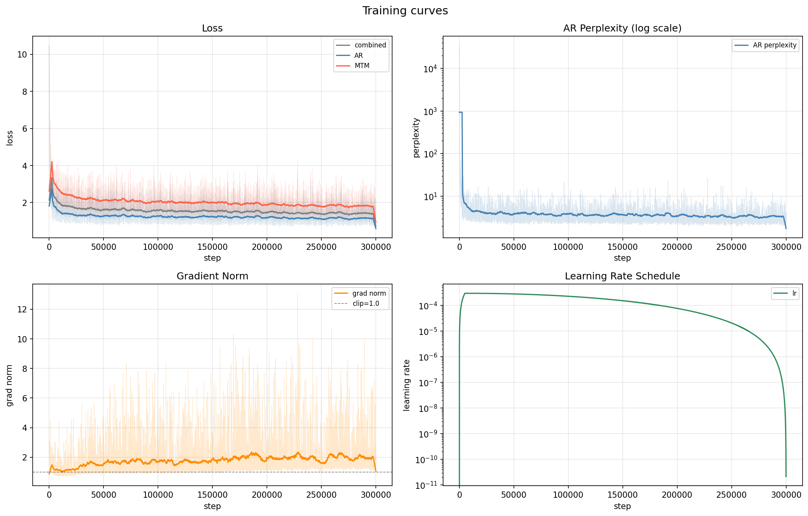

# Geospatial Trajectory Foundation Model

A 132 M-parameter Transformer pretrained on 1.68 M public taxi GPS trajectories using a
two-headed self-supervised objective: **Masked Trajectory Modeling (MTM)** for representation
quality and **Autoregressive (AR) next-location prediction** for anomaly scoring.
Trained end-to-end on **Nebius Serverless AI Jobs** — Phase 1 on a preemptible H100-SXM, Phase 2 on a 2×L40S node for parallel expert training.

The map below shows model inference on a real Porto route (Boavista → Praça da Liberdade).
Each hexagon is an H3 cell at resolution 9 (~0.1 km²). Given the first 8 cells, the AR head
predicts the next most-likely cell; the MTM head reconstructs a masked position from context.



---

## What it does

GPS trajectories are tokenized into H3 hexagonal-grid cells (resolution 9, ~0.1 km²) and fed
to a shared Transformer trunk. Two heads are trained jointly:

| Head | Attention | Task | Used for |
|---|---|---|---|
| MTM | Bidirectional | Predict masked H3 tokens | Trajectory representations |
| AR | Causal | Predict next H3 token | Anomaly scoring via perplexity |

After pretraining, the AR head gives a calibrated perplexity score for any trajectory —
detours, unusual routes, and driver fraud surface as high-perplexity sequences.

---

## Architecture

- **Backbone:** 12-layer Transformer, d_model=768, 12 heads, Flash Attention (`is_causal=True`)
- **Embedding:** spatial H3 token + dt_bucket (log-spaced Δt) + minute-of-day + day-of-week
- **Vocab:** 30,004 tokens (30,000 spatial sub-hash buckets + PAD/BOS/EOS/MASK)
- **Max sequence:** 512 tokens
- **Parameters:** 132.8 M
- **Weight tying:** MTM head and AR head share the same projection matrix

The H3 sub-hash maps any geographic cell to the same vocab regardless of city — keeping the
embedding table fixed-size and enabling cross-city pretraining without per-city vocabularies.

---

## Datasets

Both datasets are publicly available and license-clean.

| Dataset | Region | Trajectories | Sampling | Source |
|---|---|---|---|---|
| Porto Taxi (ECML/PKDD 2015) | Porto, Portugal | 1,605,409 | 15 s | Kaggle |
| T-Drive | Beijing, China | 79,042 | ~60 s | Microsoft Research |
| **Total** | | **1,684,451** | | |

Download instructions: see `scripts/download_datasets.py`.

---

## Hardware configuration

**Phase 1 — backbone pretraining**

| Parameter | Value |
|---|---|
| Instance | `gpu-h100-sxm` / `1gpu-16vcpu-200gb` |
| GPU | 1 × NVIDIA H100-SXM 80 GB |
| Compute mode | Preemptible (spot) |
| Storage | S3 mount — data read-only, checkpoints read-write |

GPU memory breakdown at batch=64, seq_len=512:

| Component | Memory |
|---|---|
| Model weights (bf16) | ~0.3 GB |
| AdamW optimizer (fp32 × 2) | ~1.1 GB |
| Activations (12 layers × 2 passes) | ~10 GB |
| Logits × 2 heads | ~2 GB |
| **Total used** | **~43 GB / 80 GB (54%)** |

**Phase 2 — geographic expert training**

| Parameter | Value |
|---|---|
| Instance | `gpu-l40s-d` / `2gpu-64vcpu-384gb` |
| GPUs | 2 × NVIDIA L40S 48 GB |
| Compute mode | Preemptible (spot) |
| Storage | S3 mounts — gold shards + road graphs read-only, checkpoints read-write |

Two experts train in parallel via `torchrun --nproc-per-node=2`: Rank 0 → Porto expert, Rank 1 → Beijing expert. A single GPU is not sufficient — Beijing's GAT operates over a 163,287-node road graph and requires its own dedicated GPU throughout training.

---

## Expected outputs and training results

| Metric | Value |
|---|---|
| Training steps | 300,000 |
| Wall time | ~12 h 43 min |
| Cost (preemptible H100) | ~$28 |
| AR perplexity: initial → final | 34,754 → **2.1** |
| Final combined loss | 0.963 |
| Checkpoints saved | 150 (every 2,000 steps + final) |



**Key training dynamics:**
- **Fast convergence phase (0–10k steps):** All losses drop sharply as the model learns token frequencies
- **Structural learning phase (10k–300k steps):** Slow, steady improvement with no plateau — more compute would help
- **Final AR perplexity of 2.1:** Model chooses between ~2 equally-plausible next hexes, matching road intersection structure
- **MTM consistently harder:** Masked reconstruction loss runs 0.5–1.0 nats above autoregressive loss throughout training
- **Stable gradients:** Gradient norm stays below clip threshold (1.0) except for occasional spikes from long Beijing sequences

Find more details in [training report](./train_report_summary.md)

---

## Setup and reproduction

### Prerequisites

- Python 3.13
- [uv](https://github.com/astral-sh/uv)
- AWS CLI
- A Nebius account with Serverless AI Jobs access
- SSH key pair for VM access: `ssh-keygen -t ed25519 -f ~/.ssh/nebius -C "nebius-build" -N ""`

### Local setup

```bash
make setup          # create venv, install requirements
source .venv/bin/activate
```

### Configure AWS CLI for Nebius S3

Create the AWS CLI profile for accessing Nebius Object Storage:

```bash
# Set your Nebius service account credentials (found in Nebius Console > IAM > Service accounts)
export ACCESS_KEY_AWS_ID="your_access_key_id"
export SECRET_ACCESS_KEY="your_secret_access_key"

# Configure AWS CLI with nebius profile
aws configure set aws_access_key_id $ACCESS_KEY_AWS_ID --profile nebius
aws configure set aws_secret_access_key $SECRET_ACCESS_KEY --profile nebius

# Test the connection
aws s3 ls --profile nebius --endpoint-url https://storage.eu-north1.nebius.cloud
```

**Note**: You can find/regenerate your access key in the Nebius console under IAM → Service accounts → your account → Access keys. The secret is only shown once at creation — if you didn't save it, delete and recreate the access key.

### Create Nebius Container Registry

Create a container registry to store the Docker image:

```bash
# Create a new container registry (replace with your preferred name)
nebius container registry create \
  --parent-id <your-project-id> \
  --name trajectory-registry

# Note the registry ID from the output and update REGISTRY in Makefile:
# REGISTRY = cr.eu-north1.nebius.cloud/<your-registry-id>
```

**Important**: Update the `REGISTRY` variable in the Makefile with your actual registry ID before running `make build-remote`.


### Debug / overfit check (local CPU)

```bash
python scripts/backbone.py --debug   # 50 trips, 300 steps — both losses must converge
```

### Data preparation

The ETL pipeline runs in four stages (`scripts/etl.py --stage <stage>`):

| Stage | Output | Description |
|---|---|---|
| `bronze` | raw parquet | GPS coordinate extraction from downloaded files |
| `silver` | filtered parquet | Trajectory segmentation, filtering, validation |
| `gold` | sharded parquet | H3 tokenization, temporal bucketing, sharding |
| `road-gold` | enhanced parquet + `road_graph.pt` | OSM road graph download, map-matching, `seg_id` per token |

```bash
# Download raw datasets (Porto Taxi + T-Drive Beijing)
python scripts/download_datasets.py

# Phase 1: Bronze → Silver → Gold
python scripts/etl.py --stage gold --regions porto beijing

# Upload gold shards to S3 (Phase 1 training data)
aws s3 cp data/gold s3://geo-trajectories/ --recursive \
  --profile nebius --endpoint-url https://storage.eu-north1.nebius.cloud

# Phase 2: Road-enhanced Gold (requires osmnx, geopandas, shapely, networkx)
pip install osmnx geopandas shapely networkx scipy
python scripts/etl.py --stage road-gold --regions porto beijing

# Validate the output before uploading
python scripts/etl.py --stage check-road-gold --regions porto beijing

# Upload road-enhanced data to S3 (Phase 2 training data)
make upload-road-gold
```

### Run training on Nebius (full reproduction)

**Phase 1 — backbone pretraining**

```bash
make build-remote       # build Docker image on Nebius VM and push to registry
make create-s3-secret   # store S3 credentials as a Nebius secret
make run-cloud          # submit a preemptible H100-SXM job (~$28, ~12h 43m)
```

Reads from `s3://geo-trajectories`, writes checkpoints to `s3://geo-trajectories-checkpoints`.
On SIGTERM (spot preemption) the current checkpoint is flushed automatically.

**Phase 2 — geographic expert training**

```bash
make upload-road-gold           # push road-enhanced gold to s3://geo-trajectories-road-enhanced
make run-cloud-phase02-multi    # submit a preemptible 2×L40S job (torchrun, both experts)
```

Both experts train simultaneously: Porto (50k steps, ~30 min) and Beijing (135k steps, ~3h 30m).
The S3 volume `s3://geo-trajectories-road-enhanced` is FUSE-mounted at
`/app/data/road_enhanced_gold` before the container starts — no data staging code required.

**Monitor a running job**

```bash
nebius ai job list --profile nebius   # find job ID

# Full log from job start (default cap is 100 lines — use --tail to raise it)
nebius ai job logs <job-id> --since 2026-06-07 --tail 100000 --profile nebius \
  > data/train_log_full.txt

# Plot training curves (auto-detects Phase 1 / Phase 2 log format)
uv run python scripts/train_curve.py data/train_log_full.txt
```


### Download the final checkpoint

```bash
make download-ckpt  # fetches ckpt_final.pt from s3://geo-trajectories-checkpoints/
```

### Run inference on a sample Porto trajectory

```bash
make inference
```

Runs both the AR head (next-token prediction) and MTM head (masked-token reconstruction) on
a 8-waypoint Porto route (Boavista → Praça da Liberdade) and saves a map visualization to
`data/inference_trajectory.png`.

---

## Repository structure

```
scripts/
  etl.py              — Bronze → Silver → Gold → Road-enhanced Gold (H3 + OSM map-matching)
  backbone.py         — Phase 1: Transformer model, training loop, inference
  experts.py          — Phase 2: Geographic GAT experts + multi-tenant scheduler
  train_curve.py      — Plot training curves (auto-detects Phase 1 / Phase 2 log format)
  download_datasets.py
  config.json         — vocab size, H3 resolution, model dimensions
data/
  gold/               — tokenized trajectory shards (Porto + Beijing)
  road_enhanced_gold/ — gold shards + road_graph.pt with OSM seg_ids (Phase 2)
    porto/road_graph.pt   — PyG graph, 5,038 nodes
    beijing/road_graph.pt — PyG graph, 163,287 nodes
  checkpoints/        — local checkpoint cache
docs/
  nebius_cli.md       — Nebius CLI reference: S3, jobs, log fetching, cost estimation
  implementation/     — phase-by-phase design docs
  train_report_summary.md
Makefile
requirements.txt
requirements-train.txt  — minimal deps for training container (no OSM/GDAL)
Dockerfile
```

---

## Roadmap

| Phase | Status | Description |
|---|---|---|
| 1 — Backbone pretraining | **Done** | Two-headed Transformer on Porto + Beijing; AR perplexity 34,754 → 2.1 |
| 2 — Geographic experts | **Training** | Per-city GAT adapters over OSM road graphs; Porto done (ar_loss 0.61), Beijing in progress |
| 3 — Anomaly head | Planned | SD-conditioned perplexity scorer; PR-AUC vs. GM-VSAE baseline |
| 4 — Serving | Planned | Batch scoring endpoint; trips-per-dollar benchmark |

**Phase 2 details**: Each city gets a `GeographicExpert` — a Graph Attention Network over the city's OpenStreetMap road graph — that fuses road context (roundabouts, signals, motorways, bridges) into the frozen backbone's hidden states. The road graphs are built by `etl.py --stage road-gold` and validated by `--stage check-road-gold` before upload. Training runs on 2 GPUs simultaneously via `torchrun`; a single GPU cannot hold both experts at wall-clock parity due to Beijing's 163k-node road graph.

---

## License

MIT
